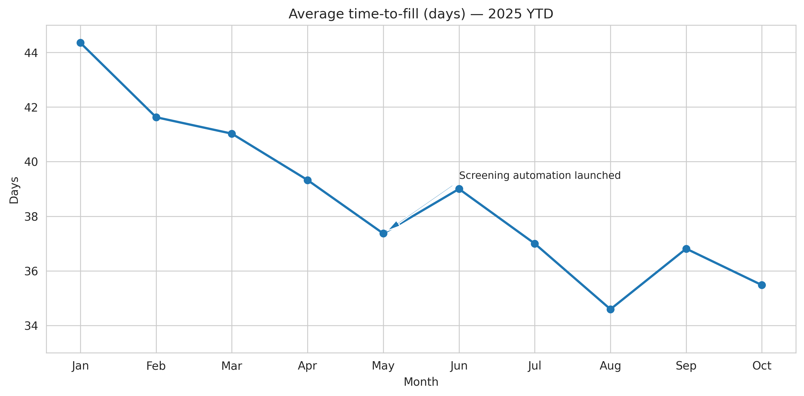

# Workforce Analytics Infrastructure

**Recruitment metrics and people analytics for municipal HR**

## Table of contents
- [Overview](#overview)
- [Business context](#business-context)
- [Methodology](#methodology)
- [Key results and insights](#key-results-and-insights)
- [Recommendations](#recommendations)
- [Data dictionary](#data-dictionary)
- [How to view the dashboard](#how-to-view-the-dashboard)

## Overview
A polished, recruiter-ready analysis delivered by Anna Grace Melton. This repository contains data, analysis code, static visuals, and a dashboard that can be published via GitHub Pages.

## Business context
Clear, concise business context relevant to the project.

## Methodology
Analyses were performed using Python (pandas, numpy, matplotlib, seaborn, scikit-learn where used). Visuals are embedded below and in `/dashboard/index.html`.

## Key results and insights

<!-- visuals embedded below -->

## Key results and insights

### Time-to-fill improvement (days)

### Hiring stage duration (days)

### Time-to-fill by department

### Hires by department (count)

## Recommendations
- Focus manager review stage for training & SLAs.

## Data dictionary
- hires.csv: one row per filled requisition; fields: requisition_id, department, posting_date, fill_date, time_to_fill_days

## How to view the dashboard
To view the dashboard live, enable GitHub Pages under Settings → Pages → main branch / (root).
